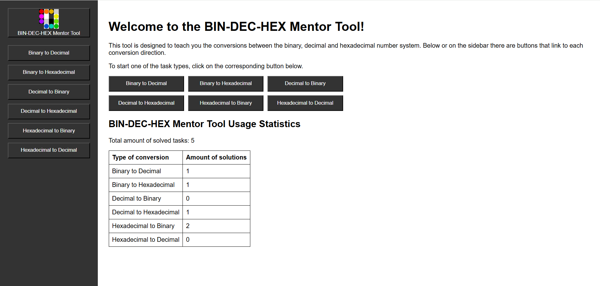

# BIN-DEC-HEX Mentor Tool

## Description

This tool has the intention to give an opportunity to practise the conversion between the binary, decimal and hexadecimal number systems.

## Features

-   Separate page per conversion type
-   Randomized generation of tasks
-   Submission of answers via text field
-   Feedback after submitting the answers

## Technology used

-   MEAN Stack, i. e.
    -   MongoDB
    -   Express
    -   Angular
    -   Node.js
-   Deployment:
-   VCS: Gitlab

## Components

### Sidebar

The sidebar contains quick links to reach the different conversion modes and to return to the homepage.

### Homepage

In the homepage the project is briefly described. Below the description there are the links to the different conversion task types: BIN-DEC, BIN-HEX, DEC-BIN, DEC-HEX, HEX-BIN, HEX-DEC.

### Usage statistics

The usage statistics can be found on the homepage and display the total amount of solved task as well as a breakdown per conversion type. Only tasks that have been finished using the "Submit" button in the task view count for the statistics.



### Tutorials

After selecting a conversion mode, a tutorial is shown which explains in detail and with examples on how to solve the conversion tasks of the corresponding mode. After having read the tutorial the button below links to the tasks.

.png>)
.png>)

### Task page

In the task page the task is done. The answer is submitted by typing it into the text field provided. Clicking "Submit" links you to the next task until 10 tasks are done. Clicking "Submit" after the 10th task links you to the result page.

.png>)

### Result page

After having all tasks done, the results are shown. For every task is shown whether the task was done correctly and a feedback message based on the percentage of correct tasks is displayed. The user gets the opportunity to do another task of the same conversion type or to return to the homepage.


### Error 404 page

If an invalid route is entered, there will be a Error 404 page displayed. By providing a button to return to the homepage, the user gets the possibility to quickly correct the error to resume their visit.


## How to run and deploy the project

### Prerequisites

Install following software:

-   **Node.js** with npm (to run TS code and to install the dependencies)
    [Download Node.js](https://nodejs.org/)
-   **MongoDB Compass**  
    [Download MongoDB](https://www.mongodb.com/products/tools/compass)
-   **Git** (to clone the project)
    [Download Git](https://git-scm.com/)

### Get the code

Use the following command to clone the repository to your local machine:

```bash
git clone https://git.uni-due.de/spfikham/web-tech/
```

Navigate to the project directory

### Install the dependencies

Navigate to the backend folder:

```bash
cd ./backend
npm install
```

Navigate to the frontend folder:

```bash
cd ../frontend
npm install
```

### Run the application

Navigate to the backend folder and run the backend:

```bash
cd backend
npm run dev
```

The backend will start on the port 3000.

In a new terminal, navigate to the frontend folder and run the Angular application:

```bash
cd frontend
ng serve
```

The frontend will be accessible at http://localhost:4200.

## Contributors

### Authors

-   Mohamed Al Atrach
-   Michail Cheklin
-   Firas Khamis
-   Khalil Meftehi

### Lecturers

-   Prof. Dr. Mohamed Amine Chatti
-   M. Sc. Shoeb Joarder
